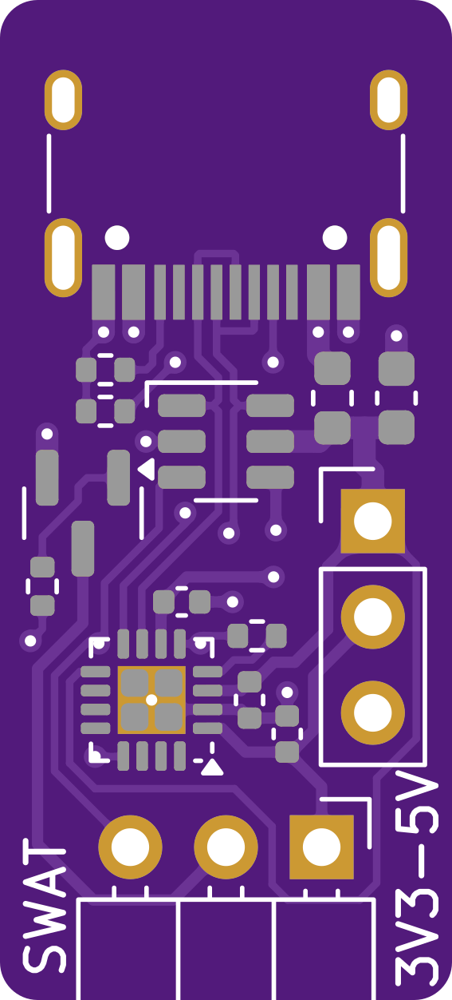
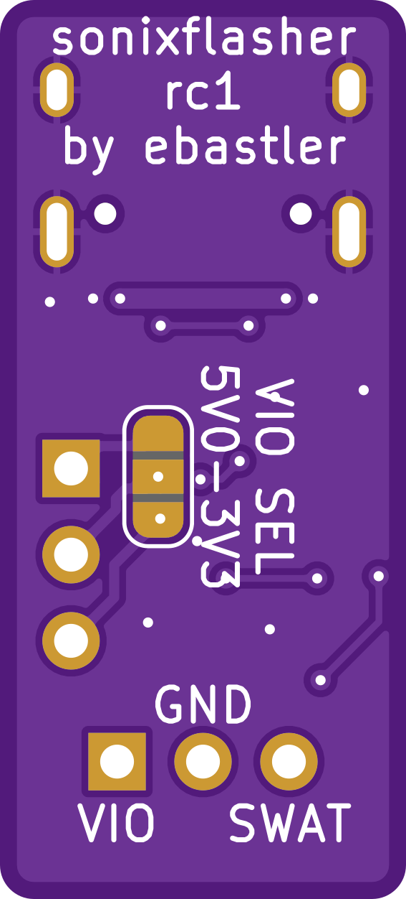

# sonixflasher

I made a small PCB around [the findings of silicagel777](https://github.com/silicagel777/SN8Flash) on how Sonix microcontrollers are programmed. Further information on how to use this PCB can be found in his repository.

Instead of having ot breadboard the components needed for the Sonix onewire protocol, I included those as well as a CH343 onto a single, tiny PCB with a USB-C port and ESD protection for all in/outputs.

NOTE: This PCB has not yet been tested.

|  |  |
|:---:|:---:|
| Top | Bottom |
